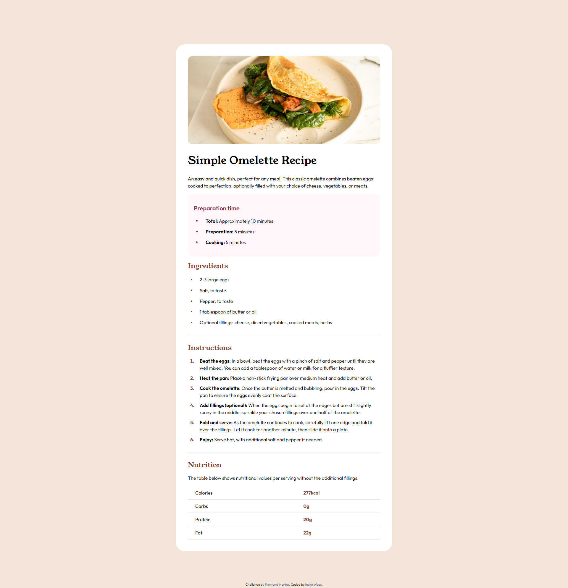
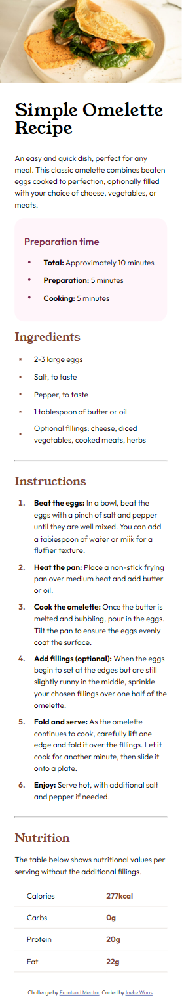

# Frontend Mentor - Recipe page solution

This is a solution to the [Recipe page challenge on Frontend Mentor](https://www.frontendmentor.io/challenges/recipe-page-KiTsR8QQKm). Frontend Mentor challenges help you improve your coding skills by building realistic projects.

## Table of contents

- [Overview](#overview)
  - [Screenshot](#screenshot)
  - [Links](#links)
- [My process](#my-process)
  - [Built with](#built-with)
  - [What I learned](#what-i-learned)
  - [Continued development](#continued-development)
  - [Useful resources](#useful-resources)
- [Author](#author)
- [Acknowledgments](#acknowledgments)

## Overview

### Screenshot

### Links

- Solution URL: [Add solution URL here](https://your-solution-url.com)
- Live Site URL: [Add live site URL here](https://ineke84.github.io/challenge-recipe-page-main/)

## My process

### Built with

- Semantic HTML5 markup
- CSS
- Free version of the challenge - no figma files

### Time spend

Devided over several days/weeks: 7 hours

### What I learned

At first I thought it was an easy one, but some challenges where:

- The heading image on mobile screen wide and on desktop an image inside a box

- Vertically centering the list item marker

- Still insecure about semantic html

### Continued development

I did initially start with the desktop version of de page and then realised I had to change especially the header image a lot for mobile. It would have been better to start inmediately with mobile and then change things for desktop. Important learning for next projects.

### Useful resources

## Author

- Frontend Mentor - [@Ineke84](https://www.frontendmentor.io/profile/Ineke84)

## Acknowledgments
